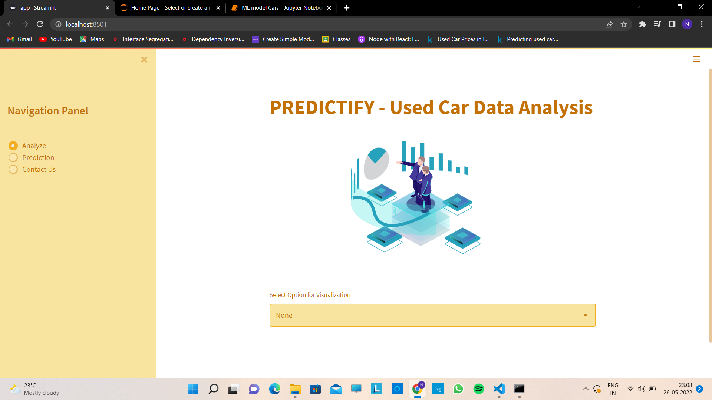
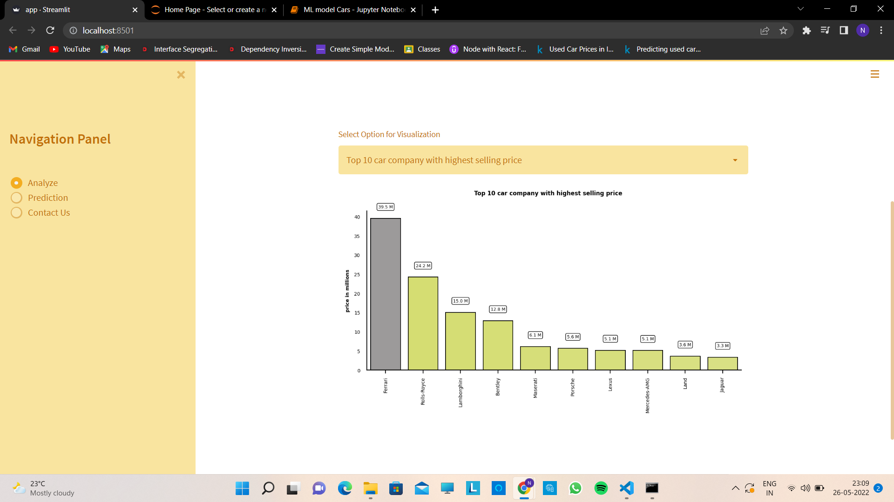
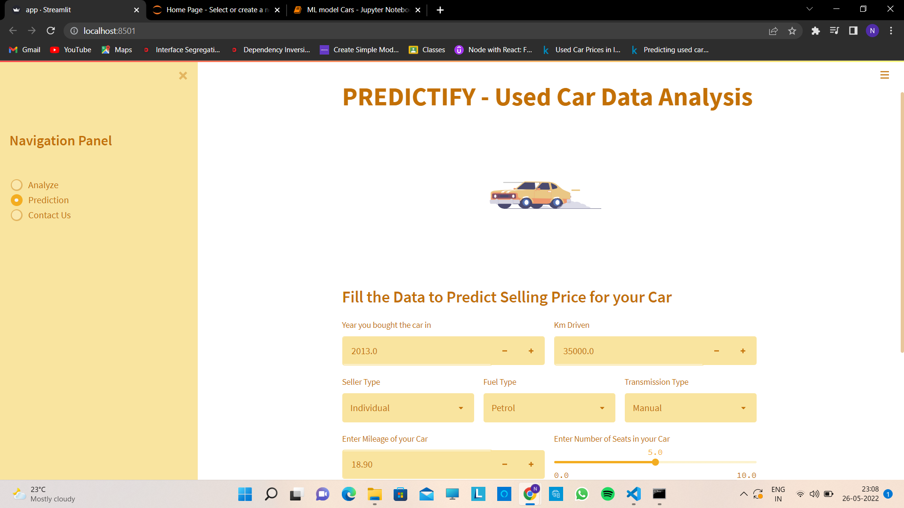
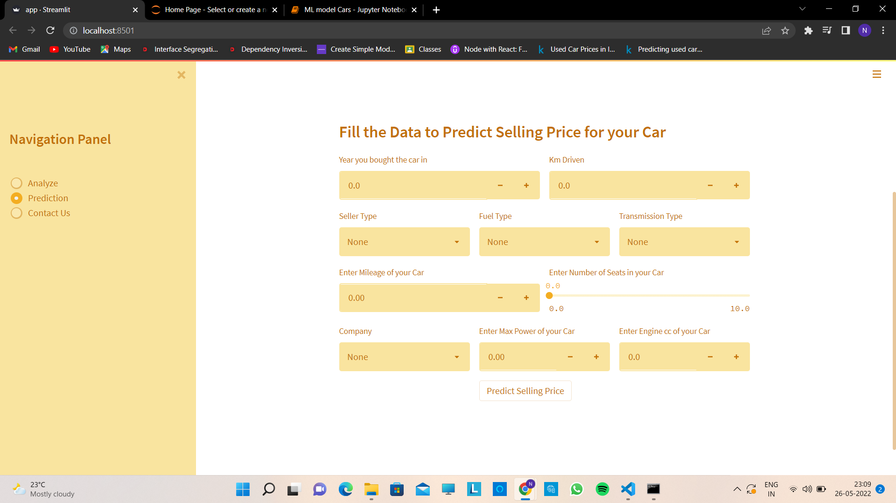
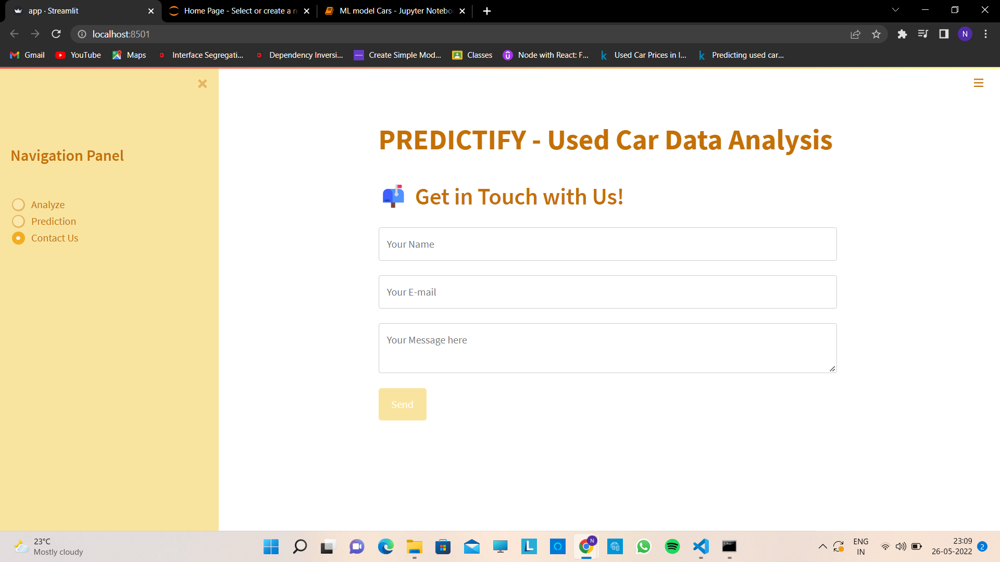
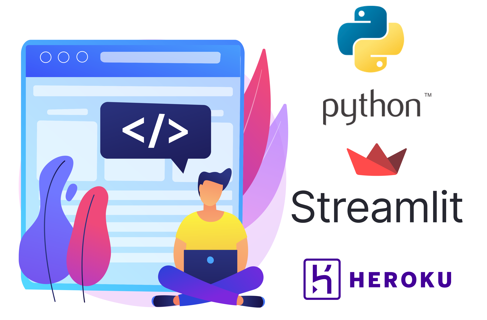

# PREDICTIFY - Used Car Data Analysis

## Submission for Microsoft Engage 2022

## Features and Interface

- ### Analyze Data of Used cars
    - Get Graphical Representation of Most Asked Queries
        - Bar Plots, Scatter Plots, Pie Charts
        
        
    
- ### Predict Selling Price of your Used Car
    - A Machine Learning model which predicts selling price based on features like:
        - Year, Kilometer driven, Engine, Mileage, Seats, Fuel type, Seller type, Company name, Max power
        
        
- ### Contact Us Form
    - Get in Touch with Us for any Query you have regarding the application.
    

## Tech Stack

- Python - Machine learning Model
- Streamlit - Frontend UI
- Heroku - Deploy 

## Process Used to build the App

    1. Data Understanding
    2. Data Preparation
    3. Modelling
    4. Evaluation
    5. Deployment
## Assessments and Metrics

The train-test split was 80-20. That is, 80% of the dataset was used for training while the 20% of it was used for testing. RandomForestRegressor with Hyperparameter Tuning was used to fit and predict the model.
## Packages and Libraries

- Python 3.10.4
- matplotlib 3.5.2
- numpy 1.22.3
- pandas 1.4.2
- scikit_learn 1.1.1
- seaborn 0.11.2
- streamlit 1.9.0
- streamlit_lottie 0.0.3

All these packages (except Python) are present in the Requirements.txt file.

## File Description

    1. All .py files are Components for UI and PreProcessing of the Data set.
    (clean.py, graph.py, contact_us.py, predict.py, process.py, predict_UI.py)
    2. imports.py - contains all the libraries to be imported.
    3. app.py is the starter file. It is the main file containg logic for the webapp.
    4. model_pkl - contains the stored model for prediction.
    5. pipe_pkl - contains the stored pipeline for prediction.
    6. ML model Cars.ipynb - contains the code and output of model building, observation, inference, etc.
    7. Cardekho_Extract.csv - Contains the dataset.
    8. requirements.txt - contains all the packages and libraries.
## Instructions to run the WebApp

1. Make sure that all the required packages and softwares are installed
    `pip install -r requirements.txt`
2. cd into the app folder
3. Run the code 
    `streamlit run app.py`
4. The app is now running at http://localhost:8501/ 
5. The app will take 1-2 minutes to train the model and generate pickle files.
6. Play with the App.
## Useful Links

- [Deployed Website](https://microsoft-app-demo.herokuapp.com/)
- [Demo Video](https://youtu.be/W0wi25fMptA)
